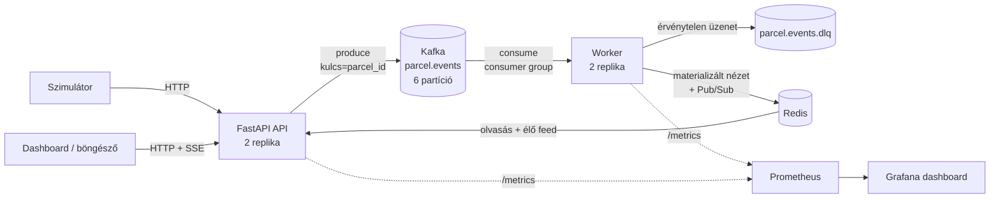

# 📦 Posta Csomagkövető — Kafka + Redis demó

Event-driven oktatási projekt a Posta DevOps csapatának: egy csomagkövető
rendszer, amely a **Kafka**, a **Redis**, a **Kubernetes (k3s)**, a **Helm**
és a **GitOps (ArgoCD)** gyakorlati használatát mutatja be egyetlen, végig
követhető alkalmazáson keresztül.

## Architektúra



A rendszer szándékosan **CQRS-szerű**: az API írási oldala csak Kafkába
termel (202 Accepted), az olvasási oldala csak Redisből olvas. Az állapotot
a worker állítja elő az eseményekből — a forrás igazsága a Kafka topic, a
Redis bármikor újraépíthető nézet.

### Mit demonstrál?

| Téma | Hol? |
|---|---|
| Partíció szerinti rendezés (kulcs = parcel_id) | `kafka_client.py` |
| Consumer group, rebalance, skálázás | `worker/main.py` (RebalanceLogger) |
| At-least-once + idempotencia = "gyakorlatilag exactly-once" | worker kézi commit + Redis dedup |
| Dead Letter Queue (poison pill kezelés) | worker → `parcel.events.dlq` |
| Redis adatszerkezetek (HASH, LIST, ZSET, SET NX, Pub/Sub) | `redis_store.py` |
| Cache-aside minta TTL-lel | `RedisStore.get_overview()` |
| Server-Sent Events élő dashboard | `/api/live` + `static/index.html` |
| Liveness vs. readiness probe | `main.py` `/healthz` `/readyz` + Helm |
| Prometheus metrikák + Grafana | `metrics.py` + ServiceMonitorok |
| Helm chart, hook Job, values | `helm/parcel-tracker/` |
| GitOps CI/CD PAT nélkül | `.github/workflows/ci.yml` |

## Lokális futtatás

```bash
docker compose up --build
```

- Dashboard: <http://localhost:8000>
- API dokumentáció (OpenAPI): <http://localhost:8000/docs>
- Kafka a hostról: `localhost:29092`, Redis: `localhost:6379`

Worker skálázási demó (figyeld a rebalance logokat):

```bash
docker compose up --scale worker=3
```

### Tesztek

```bash
python3 -m venv .venv && source .venv/bin/activate
pip install -e ".[dev]"
pytest -v
```

A tesztekhez nem kell futó Kafka/Redis (FakeProducer + fakeredis).

## Deploy a k3s klaszterre (GitOps)

A folyamat teljesen automatikus, **PAT nélkül** — minden a publikus repók
és a beépített `GITHUB_TOKEN` képességeire épül:

1. `git push` a `main`-re **ebbe a repóba** →
2. GitHub Actions: tesztek → image build → push a `ghcr.io/pauluszk/kafka-demo`-ra
   (tag = `sha-<commit>`, immutábilis) →
3. a workflow **visszaírja** az új taget a `helm/parcel-tracker/values.yaml`-ba →
4. az ArgoCD (a gitops repo `apps/kafka-demo.yaml` Application-je ezt a repót
   figyeli) észleli a változást és szinkronizál →
5. az alkalmazás elérhető: <https://kafka-demo.mattlab.hu>

> **Egyszeri kézi lépés:** az első CI futás után a ghcr.io package alapból
> privát. GitHub → profil → *Packages* → `kafka-demo` → *Package settings* →
> *Change visibility* → **Public**. Enélkül a k3s `ImagePullBackOff`-fal
> várakozik.

### Helm chart kézzel (ArgoCD nélkül)

```bash
helm upgrade --install kafka-demo helm/parcel-tracker \
  --namespace kafka-demo --create-namespace
```

## Hasznos parancsok a klaszteren

```bash
# Rebalance megfigyelése worker skálázás közben
kubectl -n kafka-demo scale deploy kafka-demo-worker --replicas=4
kubectl -n kafka-demo logs -l app=kafka-demo-worker -f | grep Rebalance

# DLQ tartalmának megnézése
kubectl -n kafka-demo exec kafka-demo-kafka-0 -- \
  /opt/kafka/bin/kafka-console-consumer.sh --bootstrap-server localhost:9092 \
  --topic parcel.events.dlq --from-beginning --max-messages 5

# Consumer group állapot (lag, partíció-kiosztás)
kubectl -n kafka-demo exec kafka-demo-kafka-0 -- \
  /opt/kafka/bin/kafka-consumer-groups.sh --bootstrap-server localhost:9092 \
  --describe --group parcel-worker

# Redis materializált nézet inspekciója
kubectl -n kafka-demo exec deploy/kafka-demo-redis -- redis-cli HGETALL stats:status_counts

# A nézet újraépítése eseményvisszajátszással (Redis kiürítése után a
# consumer group offset reset — a worker mindent újrajátszik):
kubectl -n kafka-demo exec deploy/kafka-demo-redis -- redis-cli FLUSHALL
kubectl -n kafka-demo scale deploy kafka-demo-worker --replicas=0
kubectl -n kafka-demo exec kafka-demo-kafka-0 -- \
  /opt/kafka/bin/kafka-consumer-groups.sh --bootstrap-server localhost:9092 \
  --group parcel-worker --reset-offsets --to-earliest --topic parcel.events --execute
kubectl -n kafka-demo scale deploy kafka-demo-worker --replicas=2
```

## Könyvtárszerkezet

```
src/parcel_tracker/
├── config.py          # 12-factor konfiguráció (env változók)
├── models.py          # domain modellek + állapotgép
├── kafka_client.py    # idempotens producer, retry
├── redis_store.py     # materializált nézet, statisztikák, cache, Pub/Sub
├── metrics.py         # Prometheus metrikák
├── api/               # FastAPI: írás → Kafka, olvasás → Redis, SSE, dashboard
├── worker/            # consumer group, állapotgép, DLQ, graceful shutdown
└── simulator/         # valósághű forgalom + káosz (DLQ demó)
helm/parcel-tracker/   # Helm chart (Kafka, Redis, app, monitoring)
.github/workflows/     # CI: teszt → build → ghcr push → GitOps visszaírás
```

## Oktatási anyag

A részletes tananyag (Kafka/Redis alapok, K8s/Helm/GitOps magyarázatok és
hands-on gyakorlatok) a `docs/` mappában található PDF-ben.
